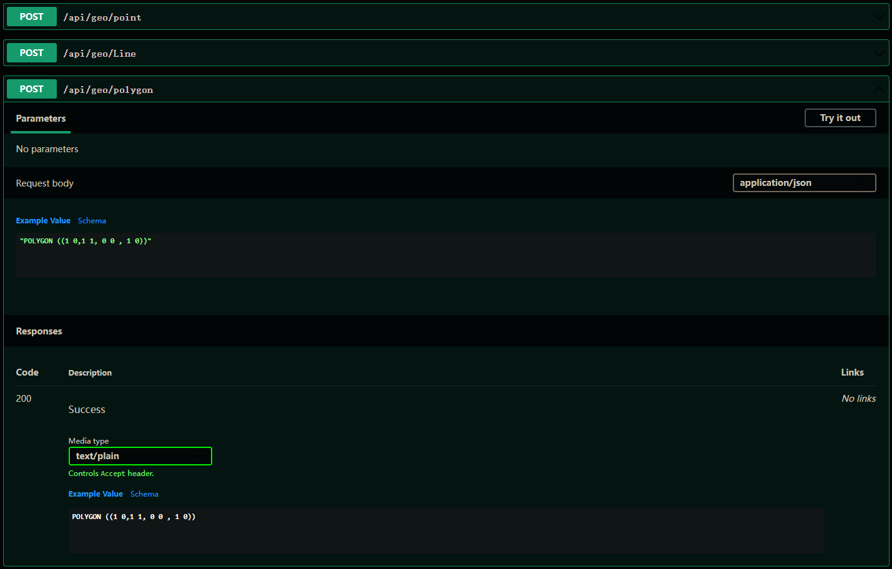

# nettopologysuite-aspnetcore-extensions [中文](./README.zh.md)

this project achived， Please use [NetTopologySuite.IO.GeoJSON4STJ](https://www.nuget.org/packages/NetTopologySuite.IO.GeoJSON4STJ)

[](https://www.nuget.org/packages/NetTopologySuite.AspNetCore.Extensions)

the extensions for **[NetTopologySuite](https://www.nuget.org/packages/NetTopologySuite/)** , work well with aspnetcore controller and swagger ui.

## JsonSerializer in aspnetcore

`Program.cs` in **net6** 

```csharp
builder.Services.AddControllers()
    .AddJsonOptions(options =>
    {
        options.JsonSerializerOptions.Converters.AddWktJsonConverter();
    });
```

`Startup.cs` in **net5 or later**

```csharp
Services.AddControllers()
    .AddJsonOptions(options =>
    {
        options.JsonSerializerOptions.Converters.AddWktJsonConverter();
    });
```

## JsonSerializer in other projects

```csharp
JsonSerializerOptions jsonSerializerOptions = new JsonSerializerOptions();
jsonSerializerOptions.Converters.AddWktJsonConverter();

var point = new Point(1,3);

var result = JsonSerializer.Serialize(point, jsonSerializerOptions);
```

## For Swagger UI

```csharp
Services.AddSwaggerGen(options =>
{
    options.SchemaFilter<WKTSchemaFilter>();
});
```


